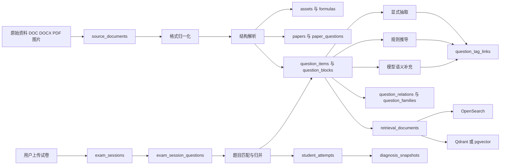

## User Requirements

### User Requirements

- 以现有 Word 富文本资料为主建设题库，资料中包含题目、图片或公式、考点、专题、分析、解答、点评等内容，接入后需保持可展示、可拆解、可追溯。
- 题库需要同时支持平台自有标准题库与学生、家长上传的试卷资料，既能分层管理权限与归属，又能在分析时复用同一套题目能力。
- 需要完整设计存储方案、拆解方案、检索方案与文档解析录入方案，并明确题目、图片、公式、讲解、标签之间的组织关系。
- 需要明确解题策略、出题意图、易错点的获取方式，区分资料原文结论、系统补充结论与人工确认结论，并保留证据与可信程度。

### Product Overview

该系统的底层应是一个面向题目对象的商业级题库，不是简单的文档仓库。每道题都应同时具备原始资料、结构化题目内容、富内容片段、教学语义、检索索引和题目关系，既能支撑题目搜索、相似题匹配、题目讲解，也能继续支撑学生考试实例分析、学情报告与家长可读的指导结论。

### Core Features

- 多表示题库存储：同一道题同时保存原始文件、题目结构、公式图片、解析点评与检索文本。
- 双层题库管理：区分平台标准题库与用户上传试卷实例，并支持题目匹配与复用。
- 教学语义沉淀：沉淀知识点、能力点、出题意图、解题策略、易错点及其证据来源。
- 混合检索与题族能力：支持全文、语义、公式、标签、相似题与题族检索。
- 学情支撑能力：可把题目能力沉淀复用于考试分析、题目级分析、学习建议与家长报告。

## Tech Stack Selection

- 已验证现有后端核心位于 `d:/10739/Exam-Analysis-Suite/analyzer/app`，技术栈为 Python 3.10、FastAPI、SQLAlchemy、Celery、Redis、Neo4j、PyMuPDF、python-docx。
- 已验证当前知识库摄入在 `analyzer/app/tasks.py` 中以 PDF、DOCX、TXT 为主，采用固定长度切块后写入 `analyzer/app/vector_db.py` 中的本地 ChromaDB，嵌入模型为 `all-MiniLM-L6-v2`。
- 已验证当前检索在 `analyzer/app/retriever.py` 中以“向量检索 + 图谱检索 + 规则合并”为主，尚未形成题目级对象库、题族、公式索引和多路检索文档。
- 已验证当前关系型数据库配置存在分裂：`shared/database.py` 指向项目根 `exam_analysis.db`，`analyzer/app/config.py` 仍指向 `sqlite:///./test.db`。商业化改造前需先统一数据库配置入口。
- 商业版建议在保留现有 FastAPI、Celery、SQLAlchemy 架构的前提下，将主业务库切换为 PostgreSQL，二进制资源落对象存储，全文检索采用 OpenSearch，向量检索优先 Qdrant 并保留本地 Chroma 作为开发回退，Neo4j 仅保留在显式关系和图谱诊断确有价值的链路中。

## Implementation Approach

先基于现有 `analyzer/app` 的平铺模块结构扩展“标准题库层 + 用户试卷实例层”的统一对象模型，再把当前简单文档摄入升级为分阶段流水线：文件登记、格式归一化、结构解析、图片与公式抽取、题目切分、教学语义标注、题目归并与题族构建、检索索引生成。系统在线查询只做过滤、召回、精排和解释，重计算全部前移到异步离线任务。

关键技术决策：

- 继续复用 `shared/models.py` 和 `shared/database.py` 作为跨模块数据模型入口，避免在现有仓库中再开第四套数据层。
- 用 `question_items + paper_questions + question_blocks + assets + formulas` 取代当前“文档切块即知识”的模式，解决 Word 富文本、公式图片、点评分析无法稳定展示和检索的问题。
- 用 `source_origin + confidence + evidence_block_id` 管理知识点、策略、意图、易错点来源，分别覆盖“原文显式抽取、规则推导、模型推断、人工复核”四类来源，避免把模型输出当唯一真值。
- 用 `retrieval_documents` 把题干、整题、解析、策略、易错点、题族拆成多视图索引，避免把核心业务表直接耦合到向量库与全文检索。
- 在现有 `main.py` 中新增独立的题库与考试实例接口前缀，尽量保留当前 `/api/ask` 与旧 `knowledge_base` 摄入入口，控制改造爆炸半径。

性能与可靠性：

- 文档入库主复杂度约为 `O(B + Q + A)`，其中 `B` 为解析块数，`Q` 为题目数，`A` 为资源数；题目归并与相似候选召回为 `O(logN + k)`，瓶颈主要在公式识别、批量 embedding 和 rerank。
- 通过 Celery 批处理、内容哈希去重、增量重建索引、低置信度复核队列与热点查询缓存，降低重复解析和重复向量化成本。
- 题目图片、整页图、公式图只存对象地址与元数据，不入关系库大字段，避免备份、查询和迁移成本失控。

## Implementation Notes

- 先统一数据库配置，再做大表扩张；否则 `shared/database.py` 与 `analyzer/app/config.py` 指向不同 SQLite 文件会造成双写和口径不一致。
- 复用现有 Celery 任务入口 `analyzer/app/tasks.py` 作为编排层，把每个阶段拆到独立模块；避免在第一期直接拆成多服务仓库。
- 保持 `analyzer/knowledge_base` 目录仍可作为首批样本输入，兼容当前手工投放资料的方式，再逐步扩展到上传接口和对象存储。
- 日志应记录文档 ID、阶段、模型名、耗时、置信度与失败原因，不记录 API Key、完整学生答案和大段隐私文本。
- 对教学语义生成采用“显式抽取优先、规则补充、模型归纳、人工复核兜底”，不要把策略、意图、易错点全部交给大模型在线即时生成。
- 题族、相似题、频次统计应走离线构建和聚合表，不应在实时问答时全量临时计算。

## Architecture Design

## Directory Structure

本次先交付完整设计，后续编码建议沿用现有 `shared/` 与 `analyzer/app/` 结构，避免无谓分仓或重构。

- `d:/10739/Exam-Analysis-Suite/analyzer/docs/commercial-question-bank-design.md`  [NEW] 商业级题库总体设计文档。沉淀双层题库、表结构、入库流水线、检索与语义来源规则，是本轮核心交付物。
- `d:/10739/Exam-Analysis-Suite/shared/database.py`  [MODIFY] 统一数据库工厂与环境变量入口，消除当前 `exam_analysis.db` 与 `test.db` 双配置问题，并为 PostgreSQL 迁移留出兼容层。
- `d:/10739/Exam-Analysis-Suite/shared/models.py`  [MODIFY] 新增标准题库层、试卷实例层、语义标签层、检索索引层 ORM 模型，保留现有用户、Provider、Prompt 模型兼容。
- `d:/10739/Exam-Analysis-Suite/analyzer/app/config.py`  [MODIFY] 扩展数据库、对象存储、全文检索、向量检索、嵌入模型与复核阈值配置，统一读取方式。
- `d:/10739/Exam-Analysis-Suite/analyzer/app/schemas.py`  [MODIFY] 增加文档接入、解析任务、题目匹配、题库检索、考试实例与报告生成的请求响应模型。
- `d:/10739/Exam-Analysis-Suite/analyzer/app/crud.py`  [MODIFY] 增加标准题、题目块、资源、标签、题族、考试实例、作答记录与报告快照的 CRUD 和聚合查询。
- `d:/10739/Exam-Analysis-Suite/analyzer/app/tasks.py`  [MODIFY] 将当前简单知识库摄入改为多阶段编排任务，负责格式归一化、结构解析、语义标注、归并、建索引和重试控制。
- `d:/10739/Exam-Analysis-Suite/analyzer/app/vector_db.py`  [MODIFY] 抽象向量后端与模型配置，支持生产向量库、批量写入、增量更新和开发回退。
- `d:/10739/Exam-Analysis-Suite/analyzer/app/retriever.py`  [MODIFY] 从单路文本块检索升级为题干、整题、解析、策略、易错点、题族的多视图混合检索与精排入口。
- `d:/10739/Exam-Analysis-Suite/analyzer/app/main.py`  [MODIFY] 新增题库接入、解析任务、题目匹配、检索查询、考试实例和报告快照接口，同时保留现有 `/api/ask` 兼容。
- `d:/10739/Exam-Analysis-Suite/analyzer/app/question_bank_parser.py`  [NEW] 负责 DOC DOCX PDF 的归一化解析、块抽取、题目切分、图片与公式引用构建。
- `d:/10739/Exam-Analysis-Suite/analyzer/app/question_bank_semantics.py`  [NEW] 负责显式抽取、规则推导、模型归纳、置信度计算与证据绑定。
- `d:/10739/Exam-Analysis-Suite/analyzer/app/question_bank_matcher.py`  [NEW] 负责题目去重、标准题匹配、题族归并、相似题关系与频次统计入口。
- `d:/10739/Exam-Analysis-Suite/analyzer/app/question_bank_indexer.py`  [NEW] 负责生成 `retrieval_documents`、写入全文索引和向量索引、处理增量更新。
- `d:/10739/Exam-Analysis-Suite/analyzer/app/storage.py`  [NEW] 统一对象存储或本地文件系统适配，管理原始文件、整页图、题图、公式图 URL 与元数据。
- `d:/10739/Exam-Analysis-Suite/alembic.ini`  [NEW] 商业级题库初始迁移配置。当前仓库虽已安装 Alembic 依赖，但尚无迁移脚手架，大规模新表设计需要用迁移管理代替 `create_all`。
- `d:/10739/Exam-Analysis-Suite/alembic/env.py`  [NEW] Alembic 环境入口，挂接 `shared.models` 元数据并支持多环境数据库连接。
- `d:/10739/Exam-Analysis-Suite/alembic/versions/0001_question_bank_init.py`  [NEW] 首个题库初始化迁移，创建标准题库、实例层、索引层和审计字段。

## Agent Extensions

### SubAgent

- **code-explorer**
- Purpose: 复核现有 `analyzer/app`、`shared/`、`analyzer/docs/` 与 `knowledge_base/` 的真实结构、入口文件和配置分裂点，确保设计文档与后续改造范围和仓库现状一致。
- Expected outcome: 形成准确的改造边界、受影响文件清单、现有摄入与检索链路事实依据，以及避免错误引用不存在模块或路径。