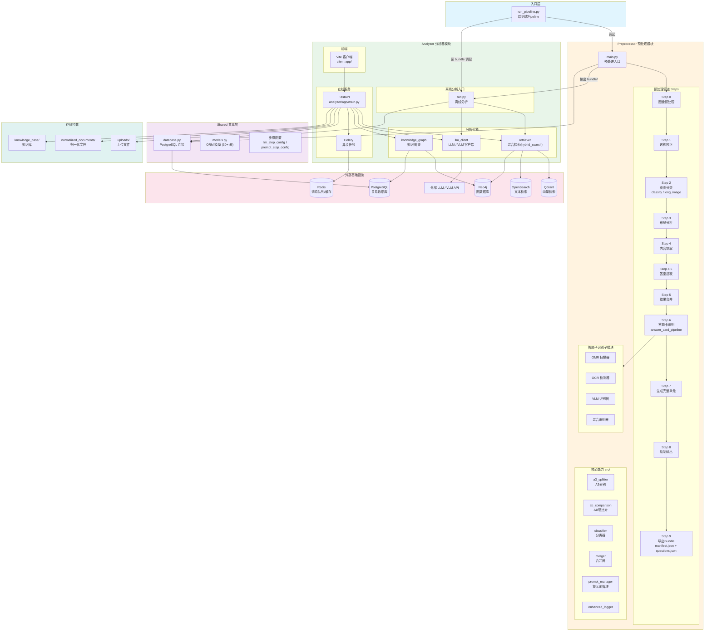
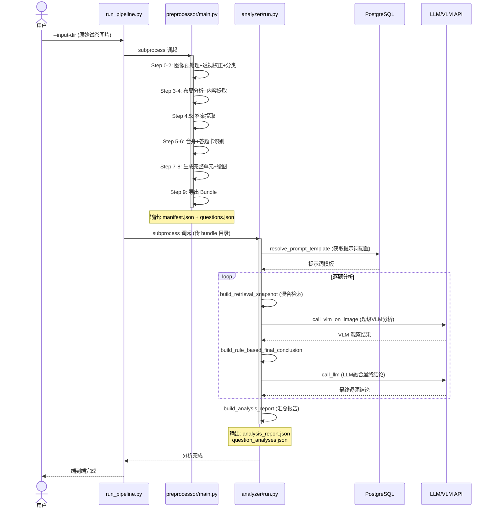
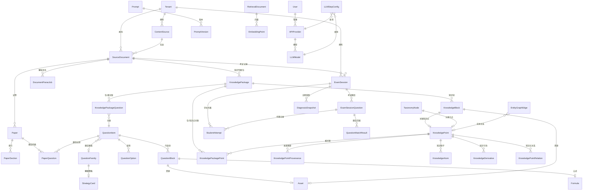
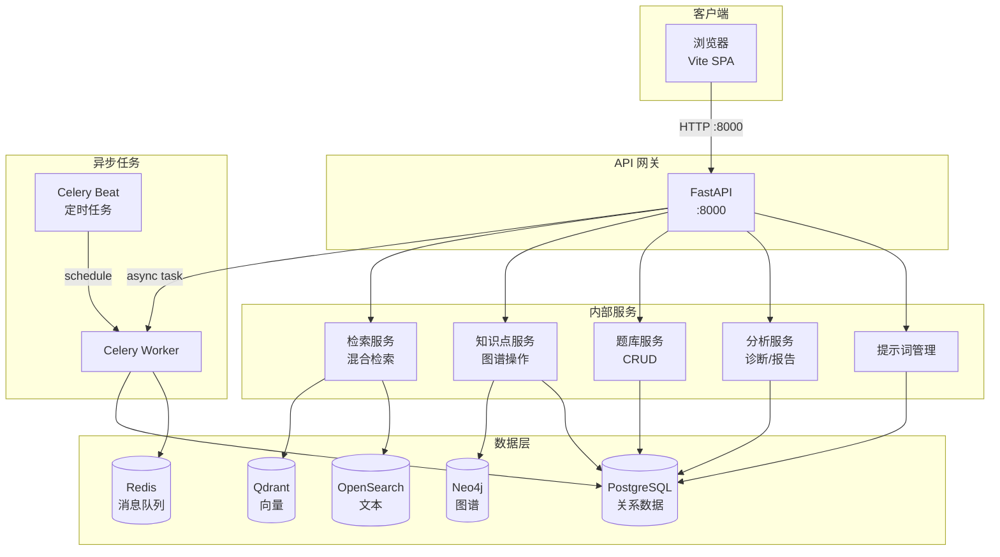
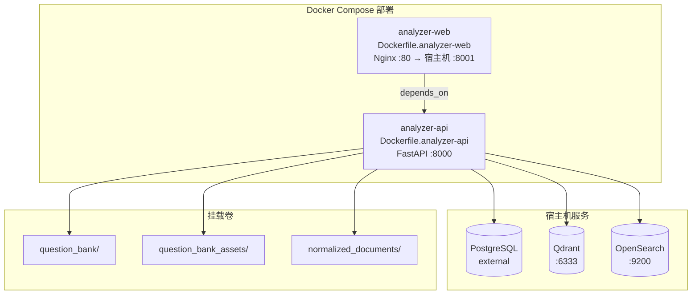
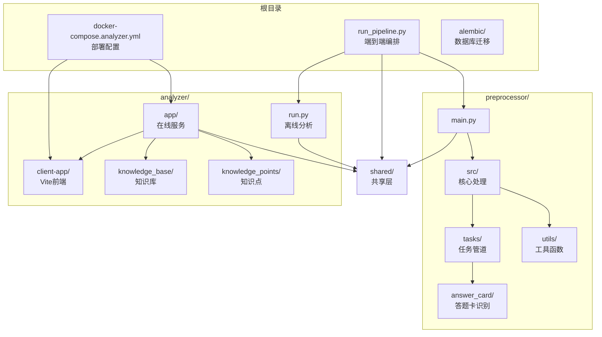

# Exam-Analysis-Suite 系统架构图

> 生成时间：2026-04-28
> 基于工程源码扫描自动整理

---

## 1. 系统全景架构

---

## 2. 离线处理链路 (端到端 Pipeline)

---

## 3. 数据模型 ER 图

---

## 4. 在线服务架构

---

## 5. 部署拓扑 (Docker Compose)

---

## 6. 预处理管道详细步骤

```mermaid
flowchart LR
    INPUT["输入<br/>原始试卷图片"] --> S0

    subgraph Pipeline["预处理管道"]
        S0["Step 0<br/>preprocess_images<br/>图像预处理/缩放"]
        S1["Step 1<br/>perspective_correction<br/>透视校正"]
        S2["Step 2<br/>classify<br/>页面分类<br/>(普通/长图)"]
        S3["Step 3<br/>analyze_layout<br/>布局分析"]
        S4["Step 4<br/>extract_content<br/>内容提取"]
        S4_5["Step 4.5<br/>extract_answers<br/>答案提取"]
        S5["Step 5<br/>merge_results<br/>结果合并"]
        S6["Step 6<br/>answer_card_pipeline<br/>答题卡识别"]
        S7["Step 7<br/>generate_complete_units<br/>完整单元生成"]
        S8["Step 8<br/>draw_output<br/>绘制标注输出"]
        S9["Step 9<br/>export_analysis_bundle<br/>导出Bundle"]
    end

    S0 --> S1 --> S2 --> S3 --> S4 --> S4_5 --> S5 --> S6 --> S7 --> S8 --> S9

    S9 --> OUTPUT["输出<br/>manifest.json<br/>questions.json"]

    style INPUT fill:#e1f5fe
    style OUTPUT fill:#e8f5e9
```

---

## 7. 包/模块依赖关系

---

## 关键文件索引

| 层级 | 文件 | 说明 |
|------|------|------|
| **入口编排** | `run_pipeline.py` | 端到端 Pipeline（preprocessor → analyzer） |
| **预处理** | `preprocessor/main.py` | 预处理模块入口 |
| **预处理任务** | `preprocessor/src/tasks/` | 10 个预处理步骤任务 |
| **答题卡** | `preprocessor/src/answer_card/` | OM/OCR/VLM 混合答题卡识别 |
| **离线分析** | `analyzer/run.py` | 分析器离线入口 |
| **在线服务** | `analyzer/app/main.py` | FastAPI 应用入口 |
| **前端** | `analyzer/client-app/` | Vite SPA 前端 |
| **数据模型** | `shared/models.py` | 30+ 张 SQLAlchemy ORM 模型 |
| **数据库** | `shared/database.py` | PostgreSQL 连接管理 |
| **配置** | `shared/llm_step_config.py` | LLM 步骤配置 |
| **配置** | `shared/prompt_step_config.py` | 提示词步骤配置 |
| **迁移** | `alembic/` | 数据库迁移脚本 |
| **部署** | `docker-compose.analyzer.yml` | Docker 部署配置 |
| **文档** | `docs/ARCHITECTURE_SNAPSHOT.md` | 架构快照文档 |