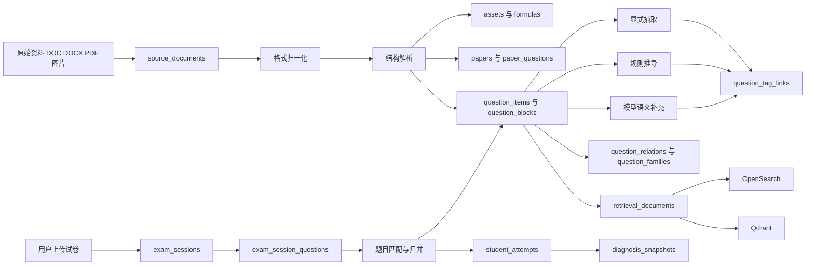

# 商业级题库总体设计

## 1. 目标与边界

### 1.1 业务目标
构建一个面向学生、家长、学校和平台运营的商业级题库底座，支撑：

- 学情报告
- 学业指导
- 考试分析
- 题目级分析
- 相似题检索
- 题族统计
- 弱点诊断
- 后续 RAG 与报告生成

### 1.2 当前题源特征
当前主输入是 Word 富文本资料，典型内容包括：

- 题目
- 选项
- 图片
- 公式图片或 Word 原生公式
- 考点
- 专题
- 分析
- 解答
- 点评

这类资料不能直接按普通文档切块入向量库，必须先转成“题目对象”。

### 1.3 本轮设计边界
本设计先覆盖：

- 技术选型
- 存储模型
- 题目拆解方式
- 文档解析录入方案
- 标签与教学语义来源
- 标准题库与用户上传试卷的分层设计
- 检索与匹配方案
- 后续编码落点

不在本轮直接实现：

- 全量前后端编码
- 多租户权限后台
- 人工审核台完整 UI
- 复杂报表前端页面

---

## 2. 现状审计结论

当前 `analyzer` 侧更接近原型：

- 关系库统一入口是 `shared/database.py`，通过 `DATABASE_URL` 连接 PostgreSQL
- `analyzer/app/config.py` 已复用共享数据库配置，不再维护独立关系库连接
- `shared/models.py` 当前承载共享业务模型，并由 Alembic 迁移维护 schema
- `analyzer/app/tasks.py` 现在是“扫描 `analyzer/knowledge_base` 文件夹 -> 提取全文 -> 写 Neo4j + Chroma”
- 当前仅支持 `.pdf/.docx/.txt`，不支持 `.doc`，当前样例 `.doc` 会被直接跳过
- `vector_db.py` 使用 Qdrant + OpenSearch 混合检索，嵌入模型由 `EMBEDDING_MODEL_NAME` 环境变量配置
- `retriever.py` 是“向量检索 + 图检索 + 规则合并”的轻量混合检索
- `main.py` 当前只暴露旧 `/api/ask` 与 `/api/ingest-knowledge` 等单体接口
- 仓库已建立 Alembic 迁移链，关系库 schema 通过迁移维护

结论：商业化必须从“文档知识库”升级为“题目对象库 + 试卷实例库 + 检索索引层”。

---

## 3. 总体架构设计

核心思想：

1. 原始文件不直接变知识，先变结构化题目对象。
2. 平台标准题库和用户上传试卷实例分层，但对象模型统一。
3. 检索不直接扫业务表，而是通过 `retrieval_documents` 生成多视图索引。
4. 语义标签必须区分来源：原文显式、规则推导、模型推断、人工复核。

---

## 4. 技术选型

## 4.1 主业务数据库：PostgreSQL
选型：统一使用 PostgreSQL，项目已不再保留 SQLite 兼容层。

原因：

- 适合复杂关系与聚合查询
- 支持 JSONB，适合富内容与扩展字段
- 支持事务、一致性与后续多租户扩展
- 适合并发写入、多实例部署与标准化迁移管理

工程约束：

- 所有业务数据库连接统一经由 `DATABASE_URL`
- 关系库 schema 统一通过 Alembic 维护

## 4.2 对象存储：MinIO / OSS / COS / S3
用于存储：

- 原始 Word / PDF
- 归一化后的 PDF
- 整页图片
- 题目裁图
- 公式图
- 题中插图

原因：

- 不把二进制塞进主库
- 便于 CDN、缩略图、备份与迁移
- 适合图片证据和前端展示

## 4.3 全文检索：OpenSearch
用于：

- BM25 关键词检索
- 题干精确召回
- 来源/年份/学科过滤
- 高亮和搜索解释

原因：

- 题库场景不能只靠向量
- 精确文本与条件过滤很关键

## 4.4 向量检索：Qdrant
用于：

- 题干语义检索
- 解析检索
- 策略卡检索
- 易错点检索
- 相似题候选召回

原因：

- 元数据过滤能力比当前本地 Chroma 更适合生产
- 适合后续多索引、多 collection 管理

开发回退：

- 保留 `ChromaDB` 作为本地开发 fallback
- 但不作为商业生产主力

## 4.5 缓存与任务：Redis + Celery
用于：

- 异步入库任务
- 批量 embedding
- 索引构建
- 热点检索缓存
- 报告缓存

原因：

- 当前已在用 Celery/Redis，继续复用成本最低
- 重计算应离线化，不应实时阻塞问答

## 4.6 图数据库：Neo4j 可选保留
建议：不作为第一期核心依赖。

保留场景：

- 显式题目关系图
- 策略、易错点、知识点关系可视化
- 复杂图谱诊断实验

不建议继续把当前 `Entity + RELATED_TO` 原型当题库主结构。

## 4.7 文档解析技术栈
- `.doc -> .docx/.pdf`：LibreOffice headless；Windows 可补 Word COM
- `.docx` 结构解析：`python-docx` + `lxml`
- `.pdf` 页面渲染：`PyMuPDF`
- OCR：后续接入 PaddleOCR 或现有 OCR 能力
- 公式提取：OMML 解析 + 公式 OCR（如 Mathpix / Pix2Text 类能力）

## 4.8 Embedding / Rerank
推荐生产方向：

- Embedding：`bge-base-zh-v1.5` 或 `bge-m3`
- Reranker：`bge-reranker-v2-m3`

原则：先用现成模型，不先自训练。

---

## 5. 双层题库设计

## 5.1 标准题库层 Canonical Bank
来源：

- 平台自采集真题
- 授权题库
- 教研整理内容
- 自建变式题

特点：

- 可商用
- 可打标签
- 可建题族
- 可做统计与全局搜索

## 5.2 用户试卷实例层 Exam Instance Layer
来源：

- 学生上传试卷
- 家长上传错题卷
- 学校上传校内卷
- 机构上传考试卷

特点：

- 默认私有或租户内可见
- 质量不稳定
- 先解析、再匹配、再归并
- 不默认直接进入全局标准题库

## 5.3 两层打通方式
统一 Question Object，但分开归属、权限和生命周期。

- 标准题：`question_items`
- 上传试卷中的题实例：`exam_session_questions`
- 两者通过匹配关系连接

这样可以做到：

- 用户上传后复用已有题目标签和讲解
- 匹配失败的题进入待审核池
- 后续人工确认后再决定是否升级到标准题库

---

## 6. 教学语义来源设计

需要沉淀的语义包括：

- 知识点
- 能力点
- 出题意图
- 解题策略
- 易错点

来源分四类：

1. `source_explicit`：资料原文明确给出，如考点、点评、分析
2. `rule_derived`：规则或模板推导，如题型模板、公式模式、关键词词典
3. `model_inferred`：大模型归纳出的候选语义
4. `human_reviewed`：人工确认后的最终版本

每条标签都必须保留：

- `source_origin`
- `confidence`
- `evidence_block_id`

原则：

- 原文显式结论优先
- 规则补充第二
- 大模型做归纳和统一表达
- 人工复核做兜底

---

## 7. 数据模型设计

## 7.1 来源与原始文件层

### `tenants`
平台、学校、机构、个人等多租户主体。

### `content_sources`
记录题源与授权边界：来源类型、授权范围、是否可商用、是否允许 AI 处理。

### `source_documents`
登记原始文档：文件名、哈希、归一化产物、解析状态、学科、年份、可见范围。

### `document_parse_jobs`
记录每个解析阶段：convert/extract/segment/annotate/index 的状态、耗时、模型和错误。

### `assets`
统一管理原始文件、整页图、题图、公式图、缩略图与 OCR 文本。

## 7.2 标准题库层

### `papers`
试卷主表，记录一份标准卷的标题、学科、年份、地区、试卷类型。

### `paper_sections`
试卷分区，如选择题、填空题、解答题。

### `question_items`
标准题对象主表，保存题目核心抽象。
关键字段：

- `stem_plain_text`
- `stem_normalized_text`
- `answer_text`
- `solution_summary`
- `difficulty`
- `has_formula`
- `has_figure`
- `family_id`
- `canonical_hash`
- `review_status`

### `paper_questions`
题目在某张卷中的出现实例，连接试卷与标准题。

### `question_blocks`
富内容块表，按顺序保存：

- 题干
- 选项
- 公式
- 图片
- 解析
- 解答
- 点评
- 考点
- 专题

这是保真展示和结构化引用的核心表。

### `question_options`
选择题选项表。

### `formulas`
公式表，保存：

- 原始来源类型
- LaTeX
- MathML
- 线性文本
- 归一化签名
- 原图引用

## 7.3 教学语义层

### `taxonomy_nodes`
统一标签树：知识点、能力点、出题意图、专题、图像类型。

### `strategy_cards`
策略卡对象，不只做标签，还存触发信号、思维步骤、常见误区。

### `mistake_patterns`
易错点卡片，后续与真实学生错误行为联动。

### `question_tag_links`
题目与知识点、能力点、策略、易错点、意图的统一关联表。

### `question_families`
题族表，支撑“像哪类题、出现多少次”。

### `question_relations`
相似题、变式题、同策略题、同易错点题的关系表。

## 7.4 检索索引层

### `retrieval_documents`
面向检索的中间文档层，按视图拆分：

- `question_stem`
- `question_full`
- `analysis`
- `strategy`
- `mistake`
- `family`

### `embedding_points`
记录向量索引点、模型名、内容哈希和后端类型。

## 7.5 用户试卷实例层

### `exam_sessions`
一次考试或一次上传记录。

### `exam_session_questions`
本次试卷切出的题实例。

### `question_match_results`
保存标准题匹配候选和最终采用结果。

### `student_attempts`
学生作答、得分、耗时、OCR 结果、教师批注。

### `diagnosis_snapshots`
面向家长和学生的学情快照，供报告页面直接读取。

## 7.6 核心表字段草案

以下字段为第一期建议的最小可用集合，后续可在不破坏主键与关系的前提下扩展。

### `content_sources`
| 字段 | 类型 | 说明 |
|---|---|---|
| id | bigint PK | 来源ID |
| tenant_id | bigint | 所属租户，可空 |
| source_name | varchar(255) | 来源名称 |
| source_type | varchar(32) | `official/licensed/self_built/school/user_upload` |
| provider_name | varchar(255) | 提供方 |
| commercial_allowed | boolean | 是否可商用 |
| ai_processing_allowed | boolean | 是否允许 OCR / 向量化 / 解析 |
| training_allowed | boolean | 是否允许训练/微调 |
| license_scope | jsonb | 授权范围 |
| expires_at | timestamp | 到期时间 |
| created_at | timestamp | 创建时间 |

### `source_documents`
| 字段 | 类型 | 说明 |
|---|---|---|
| id | bigint PK | 文档ID |
| source_id | bigint FK | 来源ID |
| tenant_id | bigint | 所属租户 |
| file_name | varchar(255) | 原文件名 |
| file_ext | varchar(16) | `doc/docx/pdf/jpg/png` |
| storage_url | text | 原始文件地址 |
| file_sha256 | varchar(64) | 文件哈希 |
| normalized_docx_url | text | 转换后的 docx |
| normalized_pdf_url | text | 转换后的 pdf |
| parse_profile | varchar(64) | 解析模板 |
| subject | varchar(32) | 学科 |
| grade | varchar(32) | 年级 |
| year | int | 年份 |
| region | varchar(64) | 地区/卷别 |
| title | varchar(255) | 标题 |
| visibility_scope | varchar(32) | `global/tenant_private/user_private` |
| parse_status | varchar(32) | `pending/running/success/failed/review` |
| created_at | timestamp | 创建时间 |

### `question_items`
| 字段 | 类型 | 说明 |
|---|---|---|
| id | bigint PK | 标准题ID |
| tenant_id | bigint | 所属租户，可空 |
| subject | varchar(32) | 学科 |
| grade | varchar(32) | 年级 |
| question_type | varchar(32) | 题型 |
| stem_plain_text | text | 检索版题干 |
| stem_normalized_text | text | 归一化题干 |
| answer_text | text | 标准答案 |
| solution_summary | text | 解法摘要 |
| difficulty | numeric(4,2) | 难度 |
| has_formula | boolean | 是否含公式 |
| has_figure | boolean | 是否含图 |
| family_id | bigint | 题族ID |
| quality_score | numeric(4,2) | 质量分 |
| canonical_hash | varchar(64) | 去重归并 hash |
| source_origin | varchar(32) | `explicit/rule/model/human` |
| review_status | varchar(16) | `draft/reviewed/published` |
| created_at | timestamp | 创建时间 |
| updated_at | timestamp | 更新时间 |

### `paper_questions`
| 字段 | 类型 | 说明 |
|---|---|---|
| id | bigint PK | 出现实例ID |
| paper_id | bigint FK | 试卷ID |
| question_item_id | bigint FK | 标准题ID，可空 |
| question_no | varchar(32) | 题号 |
| sub_question_no | varchar(32) | 小问号 |
| display_order | int | 显示顺序 |
| score_value | numeric(6,2) | 分值 |
| page_no | int | 页码 |
| anchor_bbox | jsonb | 页面坐标 |
| parse_confidence | numeric(4,2) | 切题置信度 |

### `question_blocks`
| 字段 | 类型 | 说明 |
|---|---|---|
| id | bigint PK | 块ID |
| question_item_id | bigint FK | 标准题ID |
| block_order | int | 顺序 |
| block_role | varchar(32) | `stem/option/analysis/solution/comment/knowledge/topic/formula/image/table` |
| content_format | varchar(32) | `plain_text/rich_text/html/latex/mathml/json` |
| text_content | text | 文本内容 |
| rich_content_json | jsonb | 富结构内容 |
| formula_id | bigint FK | 公式ID，可空 |
| asset_id | bigint FK | 图片/图表资源ID，可空 |
| parent_block_id | bigint | 父块，可空 |
| source_origin | varchar(32) | 来源 |
| confidence | numeric(4,2) | 置信度 |
| is_primary | boolean | 是否主内容 |

### `formulas`
| 字段 | 类型 | 说明 |
|---|---|---|
| id | bigint PK | 公式ID |
| question_item_id | bigint FK | 标准题ID |
| block_id | bigint FK | 来源块ID |
| source_type | varchar(32) | `word_omml/image_formula/ocr_formula/human_fixed` |
| latex_text | text | LaTeX |
| mathml_text | text | MathML |
| linear_text | text | 线性表达 |
| normalized_signature | text | 归一化签名 |
| parse_confidence | numeric(4,2) | 解析置信度 |
| asset_id | bigint FK | 原始公式图 |

### `question_tag_links`
| 字段 | 类型 | 说明 |
|---|---|---|
| id | bigint PK | 关联ID |
| question_item_id | bigint FK | 标准题ID |
| target_type | varchar(32) | `taxonomy/strategy/mistake` |
| target_id | bigint | 目标ID |
| relation_type | varchar(32) | `tests/requires/uses_strategy/has_intent/has_mistake` |
| source_origin | varchar(32) | `source_explicit/rule_derived/model_inferred/human_reviewed` |
| confidence | numeric(4,2) | 置信度 |
| evidence_block_id | bigint FK | 证据块 |
| approved_status | varchar(16) | `pending/approved/rejected` |

### `retrieval_documents`
| 字段 | 类型 | 说明 |
|---|---|---|
| id | bigint PK | 检索文档ID |
| tenant_id | bigint | 所属租户 |
| entity_type | varchar(32) | `question_stem/question_full/analysis/strategy/mistake/family` |
| entity_id | bigint | 对应实体ID |
| text_for_bm25 | text | 全文检索文本 |
| text_for_embedding | text | 向量文本 |
| metadata_json | jsonb | 检索过滤元数据 |
| is_active | boolean | 是否有效 |
| content_hash | varchar(64) | 内容哈希 |
| updated_at | timestamp | 更新时间 |

### `exam_sessions`
| 字段 | 类型 | 说明 |
|---|---|---|
| id | bigint PK | 考试实例ID |
| tenant_id | bigint | 租户ID |
| student_id | bigint | 学生ID |
| source_document_id | bigint FK | 上传原文档 |
| matched_paper_id | bigint FK | 匹配到的标准卷，可空 |
| exam_date | date | 考试日期 |
| subject | varchar(32) | 学科 |
| parse_status | varchar(16) | 解析状态 |
| matching_status | varchar(16) | 匹配状态 |
| analysis_status | varchar(16) | 分析状态 |
| visibility_scope | varchar(32) | 可见范围 |
| created_at | timestamp | 创建时间 |

### `exam_session_questions`
| 字段 | 类型 | 说明 |
|---|---|---|
| id | bigint PK | 实例题ID |
| exam_session_id | bigint FK | 考试实例ID |
| source_question_no | varchar(32) | 原始题号 |
| question_item_id | bigint FK | 匹配到的标准题，可空 |
| page_no | int | 页码 |
| question_crop_asset_id | bigint FK | 题图资源 |
| recognized_text | text | OCR / 识别文本 |
| parse_confidence | numeric(4,2) | 解析置信度 |
| match_confidence | numeric(4,2) | 匹配置信度 |
| review_status | varchar(16) | 审核状态 |

### `student_attempts`
| 字段 | 类型 | 说明 |
|---|---|---|
| id | bigint PK | 作答ID |
| exam_session_id | bigint FK | 考试实例ID |
| exam_question_id | bigint FK | 实例题ID |
| question_item_id | bigint FK | 标准题ID |
| student_id | bigint | 学生ID |
| student_answer_raw | text | 原始答案 |
| answer_blocks_json | jsonb | 分步作答 |
| is_correct | boolean | 对错 |
| score_earned | numeric(6,2) | 得分 |
| time_spent_seconds | int | 耗时 |
| teacher_mark_json | jsonb | 批注 |
| ocr_confidence | numeric(4,2) | OCR 置信度 |
| created_at | timestamp | 创建时间 |

---

## 8. 文档解析与入库流程

## Step 0：文件接收与登记
- 做什么：上传原始 Word/PDF/图片并登记元信息
- 技术：FastAPI 上传接口 + 对象存储 + 哈希计算
- 是否使用大模型：否
- 输出：`content_sources`、`source_documents`、原始 `assets`

## Step 1：格式归一化
- 做什么：将 `.doc` 转成 `.docx/.pdf`，并生成整页图片
- 技术：LibreOffice headless / Word COM + PyMuPDF
- 是否使用大模型：否
- 输出：`normalized_docx_url`、`normalized_pdf_url`、页图资源

## Step 2：结构解析
- 做什么：提取段落、编号、表格、图片、公式对象、标题层级
- 技术：`python-docx` + `lxml`
- 是否使用大模型：否
- 输出：文档块 JSON、中间结构树

## Step 3：图片与公式抽取
- 做什么：提取题中图片、公式图片、Word 原生公式
- 技术：docx 媒体抽取、OMML 解析、公式 OCR
- 是否使用大模型：一般否
- 输出：`assets`、`formulas` 候选

## Step 4：试卷识别与题目切分
- 做什么：识别试卷结构、题号、分区、题目边界、答案/解析边界
- 技术：规则模板 `parse_profile` + 正则 + 样式信号
- 是否使用大模型：可作为低置信度兜底，不作主流程
- 输出：`papers`、`paper_sections`、`paper_questions`

## Step 5：题目富结构重建
- 做什么：把每题重建为 `question_items + question_blocks + question_options + formulas`
- 技术：自定义 parser + 文本归一化 + 富结构序列化
- 是否使用大模型：否
- 输出：展示版、检索版、公式版三种表示

## Step 6：显式语义抽取
- 做什么：从考点、专题、分析、点评中抽取显式知识
- 技术：规则词典、模板映射、关键词抽取
- 是否使用大模型：否
- 输出：`question_tag_links(source_explicit)`

## Step 7：规则推导与模型补充
- 做什么：补全策略、意图、易错点、能力点
- 技术：题型模板、公式模式、规则引擎 + LLM 结构化输出
- 是否使用大模型：是，用于归纳和统一表达
- 输出：`question_tag_links(rule_derived/model_inferred)`、策略卡候选、易错点候选

## Step 8：题目去重、归并与题族构建
- 做什么：判断是否已有标准题、是否属于同题族、是否为变式
- 技术：文本 hash、规则比对、向量召回、reranker、公式签名匹配
- 是否使用大模型：通常否
- 输出：`question_relations`、`question_families`、匹配候选

## Step 9：检索文档构建
- 做什么：生成多视图 `retrieval_documents`
- 技术：文本拼接器 + 元数据构造器
- 是否使用大模型：否
- 输出：全文检索文档与向量文档

## Step 10：索引入库
- 做什么：写 OpenSearch、Qdrant
- 技术：BM25、Embedding、批量写入、增量更新
- 是否使用大模型：否
- 输出：检索索引与 `embedding_points`

## Step 11：低置信度复核
- 做什么：审核切题不准、公式识别差、语义标签不稳的内容
- 技术：审核队列与后台复核台
- 是否使用大模型：否
- 输出：`human_reviewed` 标签与最终发布状态

## Step 12：用户上传试卷匹配
- 做什么：解析用户试卷，匹配标准题库
- 技术：OCR、切题、相似题检索、规则融合
- 是否使用大模型：可选，不是主链路
- 输出：`exam_sessions`、`exam_session_questions`、`question_match_results`

## Step 13：学情与报告生成
- 做什么：聚合作答记录，输出知识画像、能力画像、建议
- 技术：规则诊断 + 统计聚合 + LLM 最终自然语言表达
- 是否使用大模型：是，但只用于解释层
- 输出：`diagnosis_snapshots`

---

## 9. 检索与 RAG 设计

## 9.1 不再使用单一路由检索
当前 `retriever.py` 只适合文档问答原型。商业版应按问题类型路由：

- 相似题查询
- 题目讲解查询
- 策略查询
- 易错点查询
- 学情诊断查询

## 9.2 混合检索链路
标准链路：

1. metadata filter
2. BM25 召回
3. 向量召回
4. 公式与标签补召回
5. reranker 精排
6. 证据优先生成

## 9.3 多视图索引原则
一个题目至少生成这些视图：

- 题干视图
- 整题视图
- 解析视图
- 策略视图
- 易错点视图
- 题族视图

## 9.4 输出必须证据化
RAG 不直接自由发挥，应输出：

- 结论
- 证据
- 为什么这么判断
- 置信度
- 下一步建议

---

## 10. 配置与工程改造建议

## 10.1 统一数据库入口
当前已由 `shared/database.py` 作为唯一数据库工厂。

当前状态：

- `shared/database.py` 统一读取环境变量 `DATABASE_URL`
- `analyzer/app/config.py` 复用共享数据库配置
- 文档和 README 已按 PostgreSQL-only 更新

## 10.2 引入 Alembic
当前不能再依赖 `create_all`。

建议新增：

- `alembic.ini`
- `alembic/env.py`
- `alembic/versions/0001_question_bank_init.py`

## 10.3 模块落点
建议新增模块：

- `question_bank_parser.py`
- `question_bank_semantics.py`
- `question_bank_matcher.py`
- `question_bank_indexer.py`
- `storage.py`

并保留 `tasks.py` 作为编排层。

## 10.4 API 规划
建议新增前缀：

- `/api/question-bank/documents`
- `/api/question-bank/tasks`
- `/api/question-bank/questions`
- `/api/question-bank/search`
- `/api/exam-sessions`
- `/api/reports`

旧 `/api/ask` 可暂时保留兼容，但不应继续承担商业题库主入口。

---

## 11. 分阶段实施建议

## Phase 1：题库基础设施
目标：先能稳定入库、查到、展示。

- 统一数据库配置
- 上 Alembic
- 建来源层、题库层、资源层、块层、公式层
- 完成 `.doc/.docx/.pdf` 归一化和切题
- 接入对象存储
- 生成 `retrieval_documents`

## Phase 2：教学语义与题族
目标：让题库变成教学型题库。

- 知识点树
- 能力点树
- 策略卡
- 易错点卡
- 出题意图
- 题族与相似题
- 审核队列

## Phase 3：考试实例与学情报告
目标：支撑学生、家长侧商业价值。

- 用户试卷上传
- 标准题匹配
- 作答记录
- 学情诊断快照
- 家长版/学生版说明

---

## 12. 编码起点建议

确认设计后，编码顺序建议严格按以下顺序：

1. `shared/database.py` 统一配置
2. Alembic 初始化
3. `shared/models.py` 新题库模型
4. `storage.py`
5. `question_bank_parser.py`
6. `tasks.py` 编排升级
7. `question_bank_semantics.py`
8. `question_bank_matcher.py`
9. `question_bank_indexer.py`
10. `main.py` 新接口
11. `retriever.py` 商业检索改造

---

## 13. 最终结论

商业级题库不能再把 Word/PDF 当普通知识文档处理，而应把每道题沉淀为统一 Question Object，并同时保留：

- 原始资料
- 结构化题目
- 富内容块
- 图片与公式资源
- 教学语义
- 检索索引
- 题族与关系
- 学生作答实例

这套底座一旦打好，后续学生和家长看到的学情报告、学业指导、考试分析、题目级分析，才会真正稳定、可解释、可商业化。