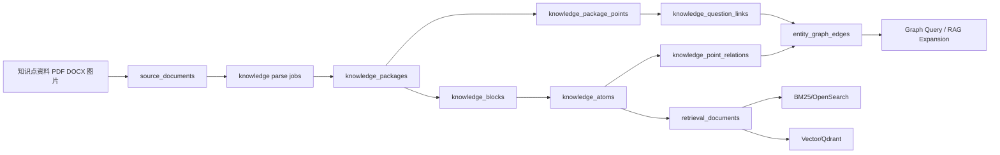
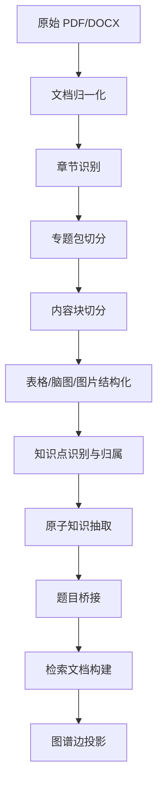

# 知识点维度技术设计文档

## 1. 文档目标

本文档用于指导“知识点维度”能力的后续开发，目标是在**完全不破坏当前题目维度能力**的前提下，为系统新增一套可扩展的知识点内容存储、检索、图谱与生成底座。

本文档重点回答以下问题：

- 如何为知识点建立独立但可关联的存储模型
- 如何兼容现有 `QuestionItem` 题目体系
- 如何支持知识点资料的复杂结构化表达
- 如何支持 RAG、图谱、精准检索、精准还原
- 如何为后续大模型二次消化与重创作提供稳定输入
- 如何确保新功能开发完成后，旧功能仍可正常运行

---

## 2. 背景与约束

### 2.1 当前系统现状

当前系统已经具备题目维度的基础数据框架，核心包括：

- `SourceDocument`：原始来源文档
- `DocumentParseJob`：解析任务日志
- `Asset`：图片、裁图、公式图等资源
- `QuestionItem`：标准题主实体
- `QuestionBlock`：题干、答案、解析、点评等内容块
- `QuestionTagLink`：题目与标签/知识点/能力点等关联
- `TaxonomyNode`：知识分类树
- `RetrievalDocument`：检索中间层
- `EmbeddingPoint`：向量索引映射

题目维度已经能承载：

- 题干、选项、答案、解析、点评
- 部分知识点/专题元数据抽取
- 检索索引构建
- 题目匹配与题库归并

### 2.2 新需求的本质

知识点维度并不是“给题目多打几个标签”，而是需要新增一套完整的内容表达体系。因为知识点资料天然具有以下特点：

- 一个知识点对应多种内容形态：讲解、归纳、脑图、表格、图片、例题、总结、误区等
- 一个专题资料通常覆盖多个知识点
- 同一道题可以从多个知识点角度被引用
- 后续需要支持基于知识点的检索、问答、学习路径、讲义生成、总结重写
- 需要保留原始资料的页面、顺序、层次和版式锚点，保证精准还原

因此，知识点维度必须是一个**独立领域模型**，而不是对题目维度的简单附加字段。

### 2.3 设计约束

本轮设计必须满足以下约束：

- **不破坏现有题目链路**
- **不改写现有题目语义**
- **不复用旧接口做高风险侵入式修改**
- **数据库演进采用纯增量方式**
- **新能力默认关闭，不影响线上旧流程**
- **允许与题目维度建立关联，但不能反向绑死题目链路**

---

## 3. 设计原则

### 3.1 分层而不是混写

题目维度继续以 `QuestionItem` 为中心；知识点维度新增以 `KnowledgePoint` 为中心的独立模型。

### 3.2 事实层与生成层分离

原始内容、结构化事实、生成衍生内容必须分层保存：

- 原始还原层：保留来源、页码、坐标、块顺序、资源锚点
- 规范事实层：保留标准化知识表达
- 生成衍生层：保留大模型重创作结果

### 3.3 检索层独立投影

业务实体不直接承担检索职责，统一通过 `RetrievalDocument` 投影为多视图检索文档。

### 3.4 关系图谱来自投影，不直接替代业务表

图谱是业务关系的投影层，不是业务事实的唯一来源。

### 3.5 新旧链路硬隔离

新增知识点能力必须有独立：

- 表
- 服务
- 任务编排
- 配置开关
- API 路由
- 管理页面入口

---

## 4. 总体架构

### 4.1 分层说明

建议采用五层结构：

1. **来源层**：`SourceDocument`、`DocumentParseJob`、`Asset`
2. **知识实体层**：`KnowledgePoint`、`KnowledgePackage`
3. **内容表达层**：`KnowledgeBlock`
4. **知识抽象层**：`KnowledgeAtom`
5. **投影层**：`RetrievalDocument`、`EmbeddingPoint`、`EntityGraphEdge`

### 4.2 与题目维度的关系

- 题目维度仍由 `QuestionItem` 主导
- 知识点维度由 `KnowledgePoint` 主导
- 两者通过 `KnowledgeQuestionLink` 连接
- 两侧检索文档均写入 `RetrievalDocument`
- 两侧均可挂在同一 `TaxonomyNode` 树下

这样可以形成“统一检索、独立事实、双向关联”的结构。

---

## 5. 领域模型设计

## 5.1 `knowledge_points`：知识点主实体

### 职责

表示“一个标准化知识点对象”，用于承担：

- 标准名称与别名治理
- 与课程体系的挂接
- 教学属性表达
- 检索主入口
- 图谱中心节点

### 建议字段

| 字段 | 类型 | 说明 |
|---|---|---|
| id | bigint PK | 主键 |
| tenant_id | bigint nullable | 所属租户，可空表示平台共享 |
| primary_taxonomy_node_id | bigint FK | 对应主课程树节点 |
| subject | varchar(32) | 学科 |
| grade_scope | varchar(64) | 年级范围 |
| canonical_name | varchar(255) | 标准名称 |
| aliases_json | jsonb | 别名、同义名、常见写法 |
| knowledge_type | varchar(32) | `concept/theorem/method/topic/model` |
| importance_level | smallint | 重要度 |
| difficulty_band | varchar(16) | 难度带 |
| exam_frequency | integer | 考频统计或分层值 |
| canonical_summary | text | 标准摘要 |
| learning_objectives_json | jsonb | 学习目标 |
| prerequisite_summary | text | 前置要求摘要 |
| common_confusions_json | jsonb | 常见混淆点 |
| source_origin | varchar(32) | `explicit/rule/model/human` |
| review_status | varchar(16) | `draft/pending/approved/rejected` |
| version_no | integer | 版本号 |
| is_active | boolean | 是否有效 |
| created_at | timestamp | 创建时间 |
| updated_at | timestamp | 更新时间 |

### 索引建议

- `(subject, canonical_name)`
- `(primary_taxonomy_node_id)`
- `(review_status, is_active)`
- `GIN(aliases_json)` 或等效 JSON 索引

---

## 5.2 `knowledge_packages`：知识专题包/资料包

### 职责

表示一份按知识点组织的内容单元，例如：

- 某 PDF 中的“专题 01 集合专辑”
- 某讲义中的“导数应用专题”
- 某教研资料中的“高考常考考向总结”

### 建议字段

| 字段 | 类型 | 说明 |
|---|---|---|
| id | bigint PK | 主键 |
| source_document_id | bigint FK | 来源文档 |
| tenant_id | bigint nullable | 所属租户 |
| package_title | varchar(255) | 专题包标题 |
| package_type | varchar(32) | `topic/chapter/lecture/review/guide` |
| subject | varchar(32) | 学科 |
| grade | varchar(32) | 年级 |
| page_range_json | jsonb | 页码范围 |
| outline_json | jsonb | 大纲结构 |
| summary_text | text | 包级摘要 |
| parse_status | varchar(16) | `pending/running/success/failed/review` |
| review_status | varchar(16) | 审核状态 |
| version_no | integer | 版本号 |
| created_at | timestamp | 创建时间 |
| updated_at | timestamp | 更新时间 |

### 设计理由

`kkkkk.pdf` 这类资料不是“一页一个知识点”，而是“一个专题包覆盖多个知识点、多种结构块”。因此必须有包级实体。

---

## 5.3 `knowledge_package_points`：专题包与知识点映射

### 职责

建立“一个专题包覆盖哪些知识点”的多对多关系。

### 建议字段

| 字段 | 类型 | 说明 |
|---|---|---|
| id | bigint PK | 主键 |
| package_id | bigint FK | 专题包 |
| knowledge_point_id | bigint FK | 知识点 |
| relation_type | varchar(32) | `core/supplement/extension` |
| weight_score | numeric(5,4) | 关联权重 |
| order_in_package | integer | 在专题中的顺序 |
| source_origin | varchar(32) | 来源 |
| confidence | numeric(4,2) | 置信度 |
| approved_status | varchar(16) | 审核状态 |

---

## 5.4 `knowledge_blocks`：知识点富内容块

### 职责

这是知识点维度最关键的内容表，用于承载：

- 讲解正文
- 归纳总结
- 考向分析
- 表格
- 脑图
- 图片
- 例题桥接内容
- 易错提醒
- 专家点评
- 对比辨析

### 建议字段

| 字段 | 类型 | 说明 |
|---|---|---|
| id | bigint PK | 主键 |
| package_id | bigint FK | 所属专题包 |
| knowledge_point_id | bigint nullable FK | 关联知识点，可空 |
| parent_block_id | bigint nullable FK | 父块 |
| block_order | integer | 顺序 |
| section_path | text | 章节路径，如 `专题01/考向分析/集合表示法` |
| block_role | varchar(32) | 内容角色 |
| content_format | varchar(32) | 内容格式 |
| raw_text | text | 原始文本 |
| normalized_text | text | 规范化文本 |
| rich_content_json | jsonb | 表格、脑图、混排结构 |
| source_page_no | integer | 来源页码 |
| anchor_bbox_json | jsonb | 页内坐标 |
| source_anchor_json | jsonb | 更细粒度锚点 |
| asset_id | bigint nullable FK | 资源引用 |
| source_origin | varchar(32) | 来源 |
| confidence | numeric(4,2) | 置信度 |
| is_primary | boolean | 是否为主内容 |
| created_at | timestamp | 创建时间 |
| updated_at | timestamp | 更新时间 |

### `block_role` 枚举建议

- `definition`
- `explainer`
- `summary`
- `exam_focus`
- `expert_commentary`
- `table`
- `mindmap`
- `image`
- `formula`
- `example_bridge`
- `pitfall`
- `comparison`
- `conclusion`

### `content_format` 枚举建议

- `plain_text`
- `markdown`
- `html`
- `json`
- `table_json`
- `mindmap_json`
- `image_ref`
- `formula_json`

### 关键要求

`knowledge_blocks` 必须同时满足两件事：

1. 支持原样还原资料内容
2. 支持后续检索与结构化处理

因此不建议只保留纯文本，必须保留 `rich_content_json + page_no + bbox + order`。

---

## 5.5 `knowledge_atoms`：知识原子层

### 职责

将复杂知识点资料进一步抽象为可组合、可检索、可生成的最小知识单元。

### 示例

对于“集合”专题，可以抽成：

- 集合元素具备确定性
- 集合元素具备互异性
- 集合元素具备无序性
- 使用列举法时应避免重复元素
- 含参数集合需要检查互异性

### 建议字段

| 字段 | 类型 | 说明 |
|---|---|---|
| id | bigint PK | 主键 |
| knowledge_point_id | bigint FK | 所属知识点 |
| package_id | bigint nullable FK | 来源专题包 |
| atom_type | varchar(32) | 原子类型 |
| canonical_text | text | 标准表达 |
| normalized_json | jsonb | 标准结构化结果 |
| formula_signature | text | 公式签名，可空 |
| importance_level | smallint | 重要度 |
| difficulty_band | varchar(16) | 难度 |
| evidence_block_id | bigint nullable FK | 证据块 |
| source_origin | varchar(32) | 来源 |
| confidence | numeric(4,2) | 置信度 |
| review_status | varchar(16) | 审核状态 |
| created_at | timestamp | 创建时间 |
| updated_at | timestamp | 更新时间 |

### `atom_type` 建议

- `definition`
- `property`
- `theorem`
- `method`
- `pitfall`
- `comparison`
- `conclusion`
- `exam_pattern`
- `memory_tip`

### 价值

`knowledge_atoms` 是后续：

- 知识点问答
- 学习总结生成
- 复习提纲生成
- 家长版解释生成
- 老师讲义重写

最稳定、最适合喂给大模型的一层。

---

## 5.6 `knowledge_question_links`：知识点与题目桥接

### 职责

表达“这道题为什么与该知识点相关”，而不是简单打标签。

### 建议字段

| 字段 | 类型 | 说明 |
|---|---|---|
| id | bigint PK | 主键 |
| knowledge_point_id | bigint FK | 知识点 |
| question_item_id | bigint FK | 题目 |
| relation_type | varchar(32) | 关联类型 |
| relevance_score | numeric(5,4) | 相关度 |
| entry_point_text | text | 该题切入该知识点的原因 |
| explanation_block_id | bigint nullable FK | 知识点视角讲解块 |
| commentary_block_id | bigint nullable FK | 知识点视角点评块 |
| source_origin | varchar(32) | 来源 |
| confidence | numeric(4,2) | 置信度 |
| approved_status | varchar(16) | 审核状态 |
| created_at | timestamp | 创建时间 |
| updated_at | timestamp | 更新时间 |

### `relation_type` 建议

- `typical_example`
- `basic_practice`
- `high_frequency_exam`
- `pitfall_example`
- `comprehensive_transfer`
- `counter_example`

### 说明

现有 `QuestionTagLink` 可继续承担“题目与知识点标签的统一轻关联”；但“知识点视角下的题目桥接解释”建议由 `knowledge_question_links` 承载。

---

## 5.7 `knowledge_point_relations`：知识点关系

### 职责

用于构建知识图谱骨架和学习路径。

### 建议字段

| 字段 | 类型 | 说明 |
|---|---|---|
| id | bigint PK | 主键 |
| source_knowledge_point_id | bigint FK | 源知识点 |
| target_knowledge_point_id | bigint FK | 目标知识点 |
| relation_type | varchar(32) | 关系类型 |
| strength_score | numeric(5,4) | 强度 |
| evidence_block_id | bigint nullable FK | 证据块 |
| source_origin | varchar(32) | 来源 |
| confidence | numeric(4,2) | 置信度 |
| approved_status | varchar(16) | 审核状态 |
| created_at | timestamp | 创建时间 |
| updated_at | timestamp | 更新时间 |

### `relation_type` 建议

- `belongs_to`
- `prerequisite_of`
- `parallel_with`
- `extends_to`
- `often_confused_with`
- `same_method_family`
- `same_exam_topic`
- `supports_ability_point`

---

## 5.8 `entity_graph_edges`：统一图谱投影边

### 职责

将题目、知识点、策略卡、易错点、资源之间的关系统一投影成可图遍历对象。

### 建议字段

| 字段 | 类型 | 说明 |
|---|---|---|
| id | bigint PK | 主键 |
| source_entity_type | varchar(32) | 源类型 |
| source_entity_id | bigint | 源 ID |
| target_entity_type | varchar(32) | 目标类型 |
| target_entity_id | bigint | 目标 ID |
| relation_type | varchar(32) | 关系类型 |
| weight_score | numeric(5,4) | 权重 |
| evidence_json | jsonb | 证据 |
| source_origin | varchar(32) | 来源 |
| confidence | numeric(4,2) | 置信度 |
| created_at | timestamp | 创建时间 |
| updated_at | timestamp | 更新时间 |

### 说明

该表是投影层，不是事实主表。业务真相仍来自：

- `knowledge_point_relations`
- `knowledge_question_links`
- `QuestionTagLink`
- `QuestionRelation`

---

## 5.9 `knowledge_derivatives`：生成衍生内容

### 职责

保存大模型重创作结果，便于审核、追溯、增量更新。

### 建议字段

| 字段 | 类型 | 说明 |
|---|---|---|
| id | bigint PK | 主键 |
| knowledge_point_id | bigint FK | 知识点 |
| derivative_type | varchar(32) | 衍生类型 |
| target_audience | varchar(32) | 面向对象 |
| prompt_version | varchar(64) | 使用的 prompt 版本 |
| source_snapshot_json | jsonb | 使用的事实快照 |
| generated_content | text/jsonb | 生成结果 |
| review_status | varchar(16) | 审核状态 |
| created_at | timestamp | 创建时间 |
| updated_at | timestamp | 更新时间 |

### `derivative_type` 示例

- `student_summary`
- `teacher_script`
- `parent_explanation`
- `mindmap_outline`
- `sprint_notes`
- `comparison_sheet`

---

## 6. 与现有代码的隔离策略

这是本设计最重要的部分。

## 6.1 数据库隔离原则

### 原则一：只增不改

本期知识点能力上线前，数据库变更必须遵循：

- **只新增表，不删除旧表**
- **不修改现有题目表的字段语义**
- **不重命名旧字段**
- **不改变旧表必填约束**
- **不改变旧接口依赖的数据结构**

### 原则二：旧表只做可选扩展，不做必需改造

允许的扩展：

- `RetrievalDocument.entity_type` 新增知识点相关类型
- `Asset.owner_type` 新增知识点相关 owner
- `TaxonomyNode.taxonomy_type` 扩充知识点相关分类值

不允许的改动：

- 让 `QuestionItem` 依赖知识点新表才能正常运行
- 让旧题目解析流程必须经过知识点流程才可落库
- 让旧页面查询必须 join 新表才可展示

## 6.2 服务隔离原则

建议新增独立服务模块：

- `knowledge_point_parser.py`
- `knowledge_point_retriever.py`
- `knowledge_point_graph.py`
- `knowledge_point_views.py`

旧链路保持不动：

- `question_bank_parser.py`
- `question_matcher.py`
- 旧 `tasks.py` 里已有题目处理逻辑

### 服务边界要求

- 知识点导入服务不得直接修改题目解析主流程
- 题目导入服务默认不触发知识点入库
- 两者只通过公共层共享：
  - `SourceDocument`
  - `Asset`
  - `RetrievalDocument`
  - `TaxonomyNode`

## 6.3 任务编排隔离原则

建议为知识点链路建立独立任务阶段：

- `knowledge_preprocess`
- `knowledge_structure_parse`
- `knowledge_atomize`
- `knowledge_link_questions`
- `knowledge_build_retrieval`
- `knowledge_build_graph`

严禁把这些阶段直接插进当前题目链路的必经步骤中。

### 推荐方式

- 新增独立入口，例如 `ingest_knowledge_package(...)`
- 新增独立 `DocumentParseJob.job_stage`
- 新增 feature flag 控制是否开启知识点处理

## 6.4 API 隔离原则

建议新增一组独立路由：

- `/api/knowledge-points/*`
- `/api/knowledge-packages/*`
- `/api/knowledge-retrieval/*`
- `/api/knowledge-graph/*`

旧路由保持稳定：

- 题目检索接口仍只服务题目维度
- 题目详情接口仍只返回题目维度内容
- 不在旧接口中强行塞入知识点复杂结构

## 6.5 UI 隔离原则

前端若后续开发，建议新增独立模块：

- 知识点管理页
- 知识点资料导入页
- 知识点详情页
- 知识图谱浏览页

不要在当前题库管理页中直接混入复杂知识点视图，避免影响现有交互和接口依赖。

## 6.6 配置隔离原则

建议新增显式配置项：

- `KNOWLEDGE_POINT_ENABLED=false`
- `KNOWLEDGE_RAG_ENABLED=false`
- `KNOWLEDGE_GRAPH_ENABLED=false`
- `KNOWLEDGE_DERIVATIVE_ENABLED=false`

上线顺序：

1. 代码合并但开关关闭
2. 测试环境开启知识点写入
3. 小范围数据验证
4. 检索灰度
5. 图谱灰度
6. 生成灰度

---

## 7. 知识点资料的摄入与结构化流程

## 7.1 摄入目标

以 `kkkkk.pdf` 这类专题资料为例，系统需要从原始 PDF 中抽出：

- 专题目录与层级结构
- 专题包与知识点挂接
- 讲解块、考向分析、总结块
- 表格、脑图、图片、公式
- 示例题及其知识点视角解释
- 原文页码、坐标、顺序信息

## 7.2 推荐解析流程

## 7.3 阶段说明

### 阶段 1：文档归一化

输入：PDF、DOCX、图片版 PDF

输出：

- 统一文本抽取结果
- 页级资源
- OCR 结果
- 页级结构块

### 阶段 2：章节识别

识别：

- 专题标题
- 一级/二级/三级小节
- “考向分析”“讲解”“总结”“点评”等栏目

### 阶段 3：专题包切分

将一整份文档切成多个 `knowledge_packages`。

### 阶段 4：内容块切分

将专题包切成多个 `knowledge_blocks`，并保留：

- 顺序
- 页码
- bbox
- 父子层级
- 内容角色

### 阶段 5：富结构抽取

对于表格、脑图、图片：

- 表格转 `table_json`
- 脑图转 `mindmap_json`
- 图片绑定 `Asset`
- 公式转结构化表达

### 阶段 6：知识点识别与归属

将块挂到一个或多个 `knowledge_points`。

### 阶段 7：原子知识抽取

将说明性内容、规则性内容和结论性内容抽成 `knowledge_atoms`。

### 阶段 8：题目桥接

把资料中提到的例题、真题、变式题与 `QuestionItem` 连接。

### 阶段 9：检索文档构建

按不同检索意图生成 `RetrievalDocument`。

### 阶段 10：图谱投影

生成知识点关系、知识点到题目关系、知识点到策略关系等边。

---

## 8. RAG 设计

## 8.1 核心原则

知识点维度不应采用“一个知识点一条向量”的简单方案，而应使用“多视图检索”。

### 原因

同一个知识点会有完全不同的检索意图：

- 想看定义
- 想看讲解
- 想看总结
- 想看例题
- 想看表格
- 想看脑图
- 想要原文出处
- 想看前置知识或易错点

这些意图不能由一个单一 chunk 同时满足。

## 8.2 检索文档设计

复用现有 `RetrievalDocument`，扩展以下 `entity_type`：

- `knowledge_point`
- `knowledge_block`
- `knowledge_atom`
- `knowledge_package`
- `knowledge_question_bridge`

### 建议 `view_type`

建议统一写入 `metadata_json.view_type`：

- `kp_definition`
- `kp_explainer`
- `kp_summary`
- `kp_exam_focus`
- `kp_pitfall`
- `kp_compare`
- `kp_table_row`
- `kp_mindmap_path`
- `kp_example_bridge`
- `kp_prerequisite`
- `kp_source_restore`

## 8.3 检索链路

### 第一步：意图识别

识别用户需要：

- 讲解型
- 归纳型
- 例题型
- 原文还原型
- 图谱型
- 易错点型
- 对比辨析型

### 第二步：元数据过滤

按以下条件过滤：

- 学科
- 年级
- 知识点编码
- 内容角色
- 来源资料
- 审核状态
- 版本
- 资料类型

### 第三步：混合召回

- BM25 精确词面召回
- 向量召回
- 公式签名召回
- 图谱扩召

### 第四步：重排

重排考虑：

- 主题匹配度
- 视图匹配度
- 内容角色匹配度
- 审核状态
- 来源可信度
- 是否主块

### 第五步：证据组装

最终不直接返回单个 chunk，而是组装：

- 主讲解块
- 原子知识
- 相关例题桥接
- 原文出处块
- 图谱补充块

---

## 9. 图谱设计

## 9.1 图谱目标

图谱用于支持：

- 知识点扩召
- 前置关系分析
- 易混点识别
- 学习路径规划
- 题目推荐
- 可解释检索

## 9.2 推荐节点类型

- `KnowledgePoint`
- `QuestionItem`
- `TaxonomyNode`
- `StrategyCard`
- `MistakePattern`
- `Asset`
- `KnowledgePackage`

## 9.3 推荐边类型

- `KnowledgePoint -> KnowledgePoint`
  - `prerequisite_of`
  - `parallel_with`
  - `often_confused_with`
  - `extends_to`
- `KnowledgePoint -> QuestionItem`
  - `typical_example`
  - `pitfall_example`
  - `high_frequency_exam`
- `KnowledgePoint -> StrategyCard`
  - `uses_strategy`
- `KnowledgePoint -> MistakePattern`
  - `has_common_mistake`
- `KnowledgePoint -> Asset`
  - `illustrated_by`
- `KnowledgePackage -> KnowledgePoint`
  - `covers`

## 9.4 图谱构建原则

- 先写领域表，再投影图谱边
- 图谱边有证据来源与置信度
- 模型推断边必须可审核
- 不把 Neo4j 或任意图数据库作为唯一事实源

---

## 10. 精准检索与精准还原设计

## 10.1 精准检索

精准检索依赖四个前提：

1. 知识点有标准编码与别名治理
2. 富结构内容有类型化表达
3. 检索文档按视图拆分
4. 检索过程先过滤再召回再重排

## 10.2 精准还原

精准还原必须依赖以下字段：

- `source_document_id`
- `source_page_no`
- `anchor_bbox_json`
- `section_path`
- `block_order`
- `raw_text`
- `rich_content_json`
- `asset_id`

### 还原能力要求

系统必须能做到：

- 还原知识点原始讲解段落
- 还原原始表格结构
- 还原脑图层级路径
- 跳转到来源页和大致区域
- 展示“该结论来自哪一块原文”

### 事实分层要求

建议严格分为三层：

#### A. 原始事实层

- `raw_text`
- `rich_content_json`
- `page_no`
- `bbox`

#### B. 规范事实层

- `normalized_text`
- `knowledge_atoms`
- `canonical_summary`

#### C. 衍生生成层

- `knowledge_derivatives`

生成内容不能覆盖 A/B 层，只能建立在 A/B 层之上。

---

## 11. 大模型消化与重创作设计

## 11.1 输入原则

后续大模型不应直接吞整份 PDF，而应优先消费：

- `knowledge_points`
- `knowledge_atoms`
- `knowledge_blocks`
- `knowledge_point_relations`
- `knowledge_question_links`
- 审核通过的 `retrieval_documents`

## 11.2 可支持的生成方向

- 学生版知识点讲解
- 冲刺版考点提纲
- 家长版易懂解释
- 教师版授课讲稿
- 例题串讲脚本
- 比较辨析卡片
- 脑图提纲
- 易错点清单

## 11.3 生成约束

- 必须引用事实快照
- 必须记录来源版本
- 必须可回溯到证据块
- 必须支持人工审核

这就是引入 `knowledge_derivatives` 的原因。

---

## 12. 开发落地建议

## 12.1 代码组织建议

建议新增以下模块，不改旧模块职责：

- `analyzer/app/knowledge_point_parser.py`
- `analyzer/app/knowledge_point_service.py`
- `analyzer/app/knowledge_point_retriever.py`
- `analyzer/app/knowledge_point_graph.py`
- `analyzer/app/knowledge_point_views.py`
- `analyzer/app/knowledge_point_schemas.py`

数据库模型建议新增到：

- `shared/models.py` 中追加新表定义
- 配套新增 Alembic 增量迁移

但迁移必须遵循“新增表优先、旧表零破坏”。

## 12.2 开发阶段划分

### Phase 1：数据底座

交付：

- `knowledge_points`
- `knowledge_packages`
- `knowledge_package_points`
- `knowledge_blocks`
- `knowledge_atoms`
- 基本 CRUD 与只读查询

### Phase 2：与题目桥接

交付：

- `knowledge_question_links`
- 专题包到题目桥接
- 基础知识点详情页

### Phase 3：检索接入

交付：

- 知识点 `RetrievalDocument` 投影
- 知识点混合检索
- 检索重排与结果组装

### Phase 4：图谱接入

交付：

- `knowledge_point_relations`
- `entity_graph_edges`
- 图谱扩召

### Phase 5：大模型衍生层

交付：

- `knowledge_derivatives`
- 衍生内容生成与审核

---

## 13. 兼容性与回滚策略

## 13.1 兼容性原则

上线知识点功能后，必须保证以下能力不受影响：

- 旧题目导入
- 旧题目检索
- 旧题目详情展示
- 旧考试会话解析
- 旧学情分析流程

## 13.2 风险点与控制方式

### 风险点 1：改动共享表导致旧查询异常

控制方式：

- 新增字段仅做可选用途
- 不改旧字段语义
- 旧查询默认不感知新数据

### 风险点 2：任务编排混用导致旧链路变慢

控制方式：

- 知识点任务单独入口
- 独立 Celery 队列或任务名空间
- 默认关闭知识点链路

### 风险点 3：检索索引混入导致题目检索质量下降

控制方式：

- 题目检索与知识点检索分 collection 或分索引
- 至少按 `entity_type` 做强过滤
- 默认不在旧检索入口混召知识点文档

### 风险点 4：前端复用旧接口导致响应结构破坏

控制方式：

- 独立 API 路由
- 独立 schema
- 不扩写旧响应结构中的复杂知识点对象

## 13.3 回滚策略

如果知识点功能上线后出现问题：

1. 关闭 feature flag
2. 停止知识点异步任务
3. 保留数据库新表，不回滚旧链路
4. 如需清理，仅清理知识点新表和知识点索引
5. 题目主流程应可直接恢复正常

---

## 14. 测试与验收建议

## 14.1 测试维度

### 单元测试

- 知识点标准名与别名匹配
- 知识块切分
- 表格与脑图结构化
- 原子知识抽取
- 检索文档构建

### 集成测试

- PDF 导入到知识专题包落库
- 专题包到知识点映射
- 知识点到题目桥接
- 检索召回链路
- 图谱投影链路

### 回归测试

必须覆盖旧功能：

- 题目导入回归
- 题目检索回归
- 题目详情回归
- 考试实例导入回归
- 试卷匹配回归

## 14.2 验收标准

### 数据层

- 能正确落库一份专题型知识点 PDF
- 能保存页码、块顺序、结构类型与资源引用
- 能挂接多个知识点

### 检索层

- 能按知识点名、别名、考向、例题等方式召回
- 能过滤到正确学科和年级
- 能输出可解释证据

### 还原层

- 能定位回原始页码与内容块
- 能还原表格/脑图/图片引用

### 兼容层

- 旧题目链路全部通过回归测试
- 关闭知识点开关后，系统行为与旧版本一致

---

## 15. 最终结论

知识点维度应被设计为一套与题目维度并行的独立领域模型，核心结构建议为：

- `knowledge_points`
- `knowledge_packages`
- `knowledge_package_points`
- `knowledge_blocks`
- `knowledge_atoms`
- `knowledge_question_links`
- `knowledge_point_relations`
- `entity_graph_edges`
- `knowledge_derivatives`

同时复用当前已有公共底座：

- `SourceDocument`
- `DocumentParseJob`
- `Asset`
- `TaxonomyNode`
- `RetrievalDocument`
- `EmbeddingPoint`

整个方案的关键不只是“能存知识点”，而是同时满足：

- 复杂内容结构化
- RAG 可用
- 图谱可扩展
- 检索精准
- 原文可还原
- 大模型可重创作
- 对旧题目链路零破坏

这份设计建议作为后续开发、数据库迁移、任务编排、接口拆分与灰度上线的统一依据。