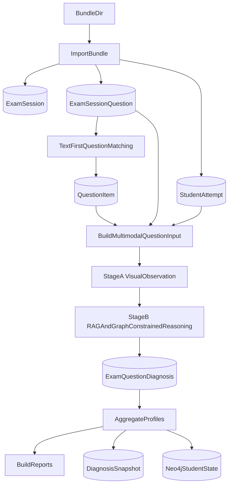

# 多模态学情分析设计文档

> 更新时间：2026-04-24
> 适用范围：`preprocessor/` 导出的学生答卷 bundle 进入 `analyzer/` 后的题目匹配、单题诊断、RAG/GraphRAG 增强与报告生成链路

## 1. 文档目标

本文档用于指导下一阶段的开发，把当前“以文本为主的 analyzer 分析链”升级为“以图像证据为主、文本为检索锚点、RAG/图谱为知识约束”的多模态学情分析链。

本文档重点回答以下问题：

- 当前 bundle 进入 analyzer 后，实际做了什么
- 当前实现与原始设计目标之间的偏差在哪里
- 为什么后续必须继续开发多模态分析链
- 新链路中图像、文本、RAG、图谱分别承担什么职责
- 需要新增哪些服务、数据结构、API 与提示词协议
- 如何以低风险、增量方式落地

---

## 2. 背景与问题

### 2.1 原始设计目标

系统中的两类输入应被严格区分：

- **A 类：学生答卷**
  - 来自 `preprocessor` 对真实试卷图片的处理结果
  - 典型输出为 bundle：`manifest.json` + `questions.json`
  - 每道题携带题图、作答图、完整单元图、题干文本、学生答案文本、识别置信度等
- **B 类：基础学科数据**
  - 已摄入的标准题库、专题资料、知识点、知识图谱、检索索引、衍生内容
  - 作用是为 A 类的单题分析和整卷分析提供知识底座

原始目标并不是“把 A 类压缩成文本后再分析”，而是：

1. 用 A 类中的**图像与结构化文本**识别学生真实作答情况
2. 用 B 类中的**题库、知识点、衍生、向量库、图谱**提供诊断约束与解释证据
3. 生成可追溯、可复核、可干预的学情结论

### 2.2 当前实现的关键偏差

当前 analyzer 已能读取 bundle，但进入 analyzer 之后，多模态信息并未成为分析主输入。

在 `[analyzer/app/exam_session_importer.py](../analyzer/app/exam_session_importer.py)` 中，bundle 导入主要做的是：

- `question_text` -> `ExamSessionQuestion.recognized_text`
- `student_answer` -> `StudentAttempt.student_answer_raw`
- `question_image_path` / `answer_image_path` / `complete_unit_image_path` -> 路径资产或 `answer_blocks_json`

这意味着：

- 图像被保存了
- 但图像没有成为 analyzer 后续判断作答的主证据
- analyzer 当前主链更多依赖文本、匹配结果、检索结果和规则判断

在 `[analyzer/app/question_matcher.py](../analyzer/app/question_matcher.py)` 中，题目匹配的 query 仅来自：

- `ExamSessionQuestion.recognized_text`

在 `[analyzer/app/exam_session_analysis_service.py](../analyzer/app/exam_session_analysis_service.py)` 中，分析阶段的 retrieval query 主要来自：

- 标准题干（若匹配成功）或 `recognized_text`
- `student_answer_raw`

当前链路并未调用视觉大模型重新理解：

- 题图
- 学生原始作答图
- 完整单元图

而这些恰恰是数学学情分析最重要的高价值证据。

### 2.3 为什么当前实现不足以支撑“最准确合理的学情分析”

从题图/作答图到文本的转换过程中，以下信息会显著丢失：

- 数学公式版式与空间结构
- 几何图形、辅助线、坐标标注、阴影区域
- 学生手写步骤、涂改、跳步、擦除痕迹
- 主观题分步推导与中间式
- OCR 错误导致的语义漂移

这些丢失会直接影响：

- 正误判断
- 错因归类
- 知识点归因
- 干预建议准确性

因此，当前实现更像：

- “文本驱动的题目匹配系统”
- “检索增强的规则化报告系统”

而不是：

- “基于学生真实作答证据的多模态学情诊断系统”

---

## 3. 当前实现快照

### 3.1 当前 bundle -> analyzer 处理流程

```mermaid
flowchart TD
  bundleDir[BundleDir(manifest+questions)] --> importBundle[ImportBundle]
  importBundle --> examSession[(ExamSession)]
  importBundle --> examQuestion[(ExamSessionQuestion)]
  importBundle --> studentAttempt[(StudentAttempt)]
  importBundle --> assetPaths[ImagePathsStoredOnly]

  examQuestion --> matchEntry[QuestionMatching]
  matchEntry --> queryText[recognized_text]
  queryText --> hybridMatch[HybridSearch(question_stem)]
  hybridMatch --> accepted{accepted?}
  accepted -->|yes| bindQuestion[Bind QuestionItem]
  accepted -->|no| needsReview[needs_review]

  bindQuestion --> analysisEntry[GenerateReports]
  needsReview --> analysisEntry
  analysisEntry --> retrievalEvidence[HybridSearch(question and knowledge evidence)]
  analysisEntry --> graphFetch[FetchQuestionContext]
  retrievalEvidence --> surfaces[StudentTeacherGovernanceReports]
  graphFetch --> surfaces
```


### 3.2 当前各模块职责

- `[preprocessor/main.py](../preprocessor/main.py)`
  - 负责图像预处理、布局、切图、内容提取、完整单元生成、bundle 导出
- `[analyzer/app/exam_session_importer.py](../analyzer/app/exam_session_importer.py)`
  - 负责把 bundle 导入为 `ExamSession` 相关实体
- `[analyzer/app/question_matcher.py](../analyzer/app/question_matcher.py)`
  - 负责基于文本做标准题匹配
- `[analyzer/app/exam_session_analysis_service.py](../analyzer/app/exam_session_analysis_service.py)`
  - 负责基于匹配结果、知识点桥接、检索与图谱生成报告
- `[analyzer/app/vector_db.py](../analyzer/app/vector_db.py)`
  - 负责混合检索（Qdrant + OpenSearch）
- `[analyzer/app/academic_graph_service.py](../analyzer/app/academic_graph_service.py)`
  - 负责 Neo4j 同步与图谱上下文获取
- `[analyzer/app/llm_client.py](../analyzer/app/llm_client.py)`
  - 已具备普通 LLM 与视觉模型调用能力，但当前学情主链未真正用上

### 3.3 当前数据变化

当前业务表以 `[shared/models.py](../shared/models.py)` 中这些实体为中心：

- `ExamSession`
- `ExamSessionQuestion`
- `StudentAttempt`
- `QuestionMatchResult`
- `DiagnosisSnapshot`

其中：

- `ExamSessionQuestion.recognized_text` 是当前匹配主输入
- `StudentAttempt.student_answer_raw` 是当前答案主输入
- `StudentAttempt.answer_blocks_json` 持有路径与辅助元数据
- 图像本身未进入 analyzer 判断主链

---

## 4. 新设计目标

### 4.1 北极星目标

把 analyzer 升级为：

> 基于学生真实作答图像证据、题目文本锚点、知识底座检索与图谱上下文，生成最准确、最可解释、最可复核的学情分析系统。

### 4.2 设计目标

1. **图像优先**
  - 题图、作答图、完整单元图必须成为单题诊断的主证据
2. **文本辅助**
  - 文本继续承担：
    - 题目匹配
    - 检索锚点
    - 图文一致性校验
3. **RAG 约束**
  - 用知识底座的检索结果约束大模型诊断，避免脱离学科体系胡乱解释
4. **GraphRAG 增强**
  - 用图谱提供知识点关系、多跳路径、学生状态上下文，而不是只做展示
5. **不确定性可表达**
  - 当图像、文本或知识证据不足时，必须明确输出“不确定 / 需人工复核”
6. **增量演进**
  - 不破坏现有 bundle 合同
  - 不破坏现有题库摄入链
  - 以开关方式逐步替换当前分析主链

### 4.3 非目标

- 本轮不重写 preprocessor 主流程
- 本轮不替换现有题目匹配算法的主体框架
- 本轮不把 Neo4j 变成业务事实主存储
- 本轮不要求所有旧报告页立即完全重构

---

## 5. 核心设计原则

### 5.1 图像是作答判断的主证据

单题作答分析时，优先级必须明确为：

1. `complete_unit_image_path`
2. `question_image_path`
3. `answer_image_path(s)`
4. `recognized_text`
5. `student_answer_raw`
6. RAG / 图谱上下文

### 5.2 文本不是判题主证据，而是检索锚点

文本在 analyzer 中应承担：

- 标准题匹配
- 检索 query
- 图像与 OCR 一致性校验
- 输出结果结构化落库

而不应独自承担：

- 单题正误判断
- 过程分析
- 错因判断

### 5.3 图文联合，而不是图文竞争

多模态分析必须设计为：

- **图优先**
- **文本校验**
- **冲突显式报告**

不能简单把大段 OCR 文本和图片一起扔给模型，否则模型容易偷懒，只看文本。

### 5.4 分阶段推理，而不是一次性糊给模型

单题分析建议拆成两个阶段：

- 阶段 A：视觉观察
- 阶段 B：图文 + RAG + 图谱融合判断

### 5.5 结果必须可追溯

每道题的最终结论必须能追溯到：

- 哪张图
- 哪段 OCR 文本
- 哪条知识证据
- 哪条图谱路径
- 哪个模型输出

---

## 6. 目标架构




---

## 7. 目标处理流程

## 7.1 阶段 0：bundle 导入（保留现状，轻改）

### 输入

- `manifest.json`
- `questions.json`

### 输出

- `ExamSession`
- `ExamSessionQuestion`
- `StudentAttempt`
- 题图 / 作答图 / 完整单元图路径

### 设计要求

- 不修改现有 bundle 合同
- 把 bundle 中已有路径继续保留下来
- 允许后续多模态分析阶段直接读取这些路径

## 7.2 阶段 1：标准题匹配（文本优先，保留现状）

### 目标

仍以文本作为匹配锚点，把学生卷题目对齐到标准题库中的 `QuestionItem`。

### 原因

题目匹配是检索问题，不是判题问题。  
文本在这里最稳定、最便宜、最容易和题库索引对齐。

### 保留现有实现

- `recognized_text` -> hybrid search
- 召回 `question_stem`
- 综合 `vector_score` / `text_score` / `formula_score`

### 可选增强

- 将题图中的公式签名、题型结构作为重排序辅助信号
- 若 `recognized_text` 太差，可增加视觉 OCR 补判步骤，但不作为首版必需项

## 7.3 阶段 2：单题多模态诊断（新增核心阶段）

这是本设计的核心增量能力。

### 输入

每道题构建 `MultimodalQuestionAnalysisInput`，包含：

- `question_image_path`
- `answer_image_path`
- `answer_image_paths`
- `complete_unit_image_path`
- `recognized_text`
- `student_answer_raw`
- `question_item_id`
- 标准题干 / 标准答案 / 解析摘要
- 题目匹配置信度
- 题目关联知识点
- top-k RAG 证据
- 图谱上下文（可选）

### 阶段 A：视觉观察模型

调用视觉模型（可复用 `[analyzer/app/llm_client.py](../analyzer/app/llm_client.py)` 中的视觉能力）完成：

- 识别学生在图中实际写了什么
- 判断作答过程是否完整
- 判断是否存在涂改、跳步、图形、辅助线等视觉特征
- 提取“视觉证据摘要”
- 输出视觉不确定性

**这一阶段不直接输出最终知识点或学情结论。**

### 阶段 B：图文 + 检索 + 图谱融合判断

在视觉观察结果基础上，再输入：

- OCR 文本
- 标准题信息
- RAG 检索证据
- 图谱路径

输出：

- 正误判断
- 错因
- 知识点归因
- 置信度
- 是否需要人工复核
- 建议

### 为什么要分两阶段

因为一次性给太多文本时，模型可能偷懒，只看 OCR。  
分两阶段可以显式要求：

- 先看图
- 再用文本校验
- 再用知识证据约束

## 7.4 阶段 3：RAG 增强

当前 RAG 保留，但职责需要被重新定义。

### 当前职责

- 题目匹配阶段：找标准题
- 分析阶段：补充证据

### 目标职责

- 不直接替代视觉判断
- 为大模型提供：
  - 标准题解释
  - 解题规则
  - 知识点讲解
  - 易错点对比
  - 衍生干预材料

### 检索分层

建议显式区分两类 evidence：

1. **QuestionEvidence**
  - 与标准题、题解、题目解析相关
2. **KnowledgeEvidence**
  - 与知识点、知识块、原子、衍生材料相关

### 检索输入

仍建议以文本为主：

- 标准题干 / OCR
- 学生答案文本
- 阶段 A 生成的“视觉观察摘要”

### 检索输出

统一投影为结构化 evidence：

- `source_type`
- `source_id`
- `title`
- `snippet`
- `score`
- `metadata`

## 7.5 阶段 4：GraphRAG 增强

### 当前问题

当前图谱更多是在分析后做补充说明。

### 目标职责

图谱应承担三类增强作用：

1. **题 -> 点**
  - 题目命中的知识点关系验证
2. **点 -> 点**
  - 同层/上下位/相关点扩展
3. **学生 -> 点**
  - 历史掌握/薄弱/不确定状态叠加

### 调用时机

建议改为：

- 先做一次轻量图谱上下文获取
- 作为阶段 B 的输入之一
- 不是只在最终出报告时才补上

### 输出

- `graph_path`
- `graph_summary`
- `graph_constraints`

## 7.6 阶段 5：整卷聚合与报告生成

在单题多模态诊断完成后，再聚合为：

- `knowledge_profile`
- `mistake_profile`
- `action_plan`
- `student report`
- `teacher report`
- `governance report`

这里的聚合应优先依赖：

- 单题诊断的结构化结果
- 不再直接依赖 OCR 文本本身

---

## 8. 新的数据契约

## 8.1 bundle 合同

首版建议：

- **不修改** `manifest.json + questions.json` 合同
- 继续复用 preprocessor 已输出的：
  - 题图
  - 作答图
  - 完整单元图
  - OCR 文本
  - 答案文本
  - confidence

原因：

- 当前 bundle 已经足够支撑多模态 analyzer 输入
- 优先解决 analyzer 未消费这些信息的问题

## 8.2 analyzer 内部中间对象

建议新增内部数据契约（不一定首版就持久化为新表）：

### `MultimodalQuestionAnalysisInput`

- `exam_session_id`
- `exam_question_id`
- `source_question_no`
- `question_item_id`
- `question_image_path`
- `answer_image_paths`
- `complete_unit_image_path`
- `recognized_text`
- `student_answer_raw`
- `match_confidence`
- `knowledge_point_ids`
- `retrieval_evidence`
- `graph_context`

### `VisualObservationResult`

- `observed_answer`
- `observed_steps`
- `visual_features`
- `visual_conflicts`
- `visual_confidence`
- `requires_manual_review`

### `ExamQuestionDiagnosis`

- `correctness`
- `mastery_level`
- `confidence`
- `knowledge_points`
- `error_pattern`
- `root_cause`
- `study_advice`
- `visual_evidence_summary`
- `text_consistency_summary`
- `retrieval_evidence`
- `graph_path`

## 8.3 持久化策略

首版建议：

- 不急着新增大表
- 先把多模态单题结果落到：
  - `DiagnosisSnapshot.ability_profile_json`
  - 或新增轻量 JSON 存储字段

二期再评估是否拆出独立表：

- `exam_question_diagnoses`
- `exam_question_visual_evidence`

---

## 9. 服务与模块设计

## 9.1 新增服务

建议新增：

- `analyzer/app/exam_session_multimodal_service.py`
  - 构造多模态分析输入
  - 调用视觉模型
  - 组织图文 + RAG + 图谱联合推理
- `analyzer/app/exam_session_evidence_service.py`
  - 统一组装 question/knowledge evidence

## 9.2 现有服务改造

### `[exam_session_importer.py](../analyzer/app/exam_session_importer.py)`

- 保持主逻辑不变
- 补充更清晰的路径标准化与分析输入准备

### `[question_matcher.py](../analyzer/app/question_matcher.py)`

- 保持文本优先匹配
- 后续可增加视觉辅助重排序，但不是首版强制项

### `[exam_session_analysis_service.py](../analyzer/app/exam_session_analysis_service.py)`

应从“最终分析实现”调整为“聚合编排器”：

- 负责总流程 orchestration
- 不再直接承担所有判断逻辑
- 单题诊断委托给新的 multimodal service

### `[academic_graph_service.py](../analyzer/app/academic_graph_service.py)`

- 保留现有同步能力
- 新增更适合单题诊断前置调用的图谱上下文接口（可在现有 `fetch_question_context()` 基础上扩展）

### `[llm_client.py](../analyzer/app/llm_client.py)`

- 复用现有 `call_llm()` 与视觉能力
- 为 analyzer 增加专用 step key，如：
  - `analyzer.question_visual_observation`
  - `analyzer.question_multimodal_reasoning`

---

## 10. Prompt 设计原则

## 10.1 视觉模型阶段

必须要求模型：

- 先基于图像观察学生真实作答
- 明确指出看到了哪些步骤/图形/涂改/辅助线
- 不直接生成最终知识诊断
- 若图像无法判断，输出“不确定”

## 10.2 多模态推理阶段

必须要求模型：

- 以图像观察结论为主
- OCR 文本为辅助
- 若图文冲突，以图像为准
- RAG/图谱证据用于知识约束
- 输出显式证据归因

## 10.3 反偷懒机制

为防止模型只看文本，建议要求输出：

- `visual_evidence_summary`
- `ocr_consistency_check`
- `final_judgement`

并在提示词中声明：

- 若未引用视觉证据，不视为有效答案

---

## 11. API 与产品面改造

## 11.1 API

保留现有：

- `POST /api/exam-sessions/import-bundle`
- `POST /api/exam-sessions/{id}/match`
- `POST /api/exam-sessions/{id}/analysis/generate`
- 报告读取接口

新增/增强：

- 可选增加 `analysis_mode`
  - `text_only`
  - `multimodal`

首版建议默认：

- 老链路仍可跑
- 新链路由开关启用

## 11.2 报告面

前端报告页后续应新增以下展示位：

- 视觉证据摘要
- 图文冲突提示
- 关键作答图预览
- 证据来源（RAG / 图谱）

但这不应阻塞 analyzer 核心链路先落地。

---

## 12. 分阶段落地方案

## Phase 1：接通多模态单题诊断

目标：

- bundle 导入后，新增视觉观察 + 图文联合推理
- 结果写回现有 `question_analyses`

范围：

- 新增 multimodal service
- 改造 `generate_reports()`
- 新增提示词与 step key

不做：

- 不改报告前端
- 不改 bundle 合同

## Phase 2：接通 GraphRAG 前置增强

目标：

- 图谱上下文进入单题诊断输入，而不是仅做事后补充

范围：

- 调整 `academic_graph_service` 调用顺序
- 增强 graph context 输出结构

## Phase 3：补齐结果可视化与复核面

目标：

- 在报告页和测试页中展示：
  - 作答图
  - 视觉证据摘要
  - 图文冲突
  - 复核原因

## Phase 4：把 source_document 绑定从“标记”升级为“可选约束”

当前 `ExamSession.source_document_id` 主要是溯源字段。  
后续可升级为：

- 若绑定了题库文档，则可把匹配候选优先收敛到该文档对应试卷范围
- 或在排序时给予更高先验

但这不是本轮多模态 analyzer 的核心前置。

---

## 13. 风险与注意事项

### 13.1 不要让视觉链拖垮整体延迟

建议：

- 单题视觉诊断可异步/批量
- 对明显选择题与高置信简单题可走轻量模式

### 13.2 不要用 OCR 文本替代视觉证据

OCR 只能是辅助锚点，不能重新成为主输入。

### 13.3 不要把图谱仅当展示层

图谱要在单题诊断前进入 reasoning input。

### 13.4 不要破坏现有 bundle 合同

优先消费已有信息，而不是先改 preprocessor 输出。

---

## 14. 验收标准

当以下条件同时满足时，可认为新链路达到可用状态：

1. 对标准数学 bundle，analyzer 能在 `multimodal` 模式下运行完整链路
2. 单题分析时，图像证据参与模型判断，而不只是文本检索
3. 输出中包含明确的视觉证据摘要
4. 图文冲突时，模型能显式指出并降置信度
5. RAG 证据与图谱路径能进入单题分析，而不只是事后展示
6. 整卷报告仍能稳定生成

---

## 15. 最终结论

当前 analyzer 的主要问题不是“没有检索和图谱”，而是：

> preprocessor 已经辛苦抽出的高价值多模态证据，在 analyzer 主分析链中没有被真正消费。

因此，下一阶段开发的核心，不是继续堆更多文本规则，而是：

> 把 analyzer 从“文本驱动的检索增强报告系统”升级为“图像优先、文本辅助、RAG/图谱约束的多模态学情诊断系统”。

这才与系统的原始设计目标一致，也更接近“依据学生真实作答给出最准确合理的学情分析”。